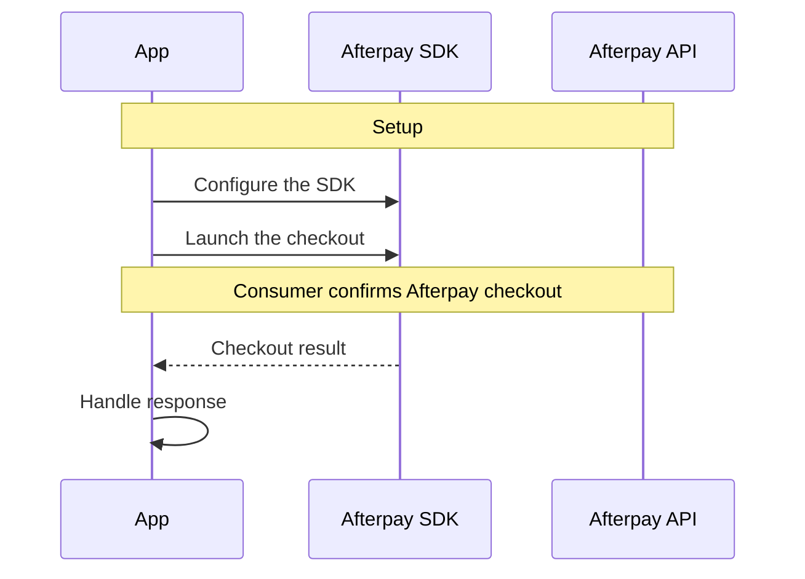

# Checkout V3
{: .no_toc }
<details open markdown="block">
  <summary>
    Table of contents
  </summary>
  {: .text-delta }
- TOC
{:toc}
</details>

{: .alert }
> Checkout V3 is currently available in the following region(s): US, UK, Australia and Canada

Checkout Version 3 generates a one-time payment card for every Afterpay order and provides the card number to insert into your credit card checkout. This allows for a front-end-only integration. The one-time payment card is Visa for the US, UK, and Canada. In Australia the one-time payment card is Mastercard.

## How it works

The transaction uses a one-time virtual payment card, which has a unique card number. Once the virtual card exists, you use it to handle authorization, capture, and refunds. Your integration is simplified, as you don’t have to integrate with additional endpoints.

{: .note }
Always set V3 Configuration before presentation, otherwise you will incur an assertionFailure. See the **Set Configuration** section below.

## Set the V3 Configuration

1. Set the configuration as follows:
```swift
Afterpay.setV3Configuration(
  CheckoutV3Configuration(
        shopDirectoryMerchantId: "your_merchant_id",
        region: .US,
        environment: .production
  )
)
```
2. Present the checkout modally:
```swift
Afterpay.presentCheckoutV3Modally(
    over: viewController,
    consumer: Consumer(email: "example@email.com"),
    orderTotal: OrderTotal(total: 100, shipping: .zero, tax: .zero),
    items: [ Product(name: "coffee") ] 
) { result in
    switch result {
    case .success(data: let data):
      /// The virtual card details
      /// The time before which an authorization needs to be made on the virtual card.
      /// The collection of tokens required to update the merchant reference or cancel the virtual card
    case .canceled(reason: let reason):
      // Handle checkout cancellation
  }
}
```
3. Optionally, if you do not have an order number (merchantReference) at the time of launching the Afterpay V3, you will use the `Afterpay.updateMerchantReferenceV3` method to associate the order with the tokens.
```swift
  /// Updates Afterpay's merchant reference for the transaction represented by the provided `tokens`.
  /// - Parameters:
  ///   - merchantReference: A unique ID identifying the transaction.
  ///   - tokens: The set of tokens returned after a successful call to `Afterpay.presentCheckoutV3Modally`.
  Afterpay.updateMerchantReferenceV3(
      with: "merchantReference", 
      tokens: data.tokens
    ) { [weak self] result in
      switch result {
      case .success: 
        // This endpoint returns a 204, so no response body
      case .failure(let error):
        // Handle failure 
      }
    }
```

## Sequence Diagram
The below diagram describes the happy path.

[example-server-param]: https://github.com/afterpay/sdk-example-server/blob/5781eadb25d7f5c5d872e754fdbb7214a8068008/src/routes/checkout.ts#L28
[express-checkout]: https://developers.afterpay.com/afterpay-online/reference#what-is-express-checkout
```